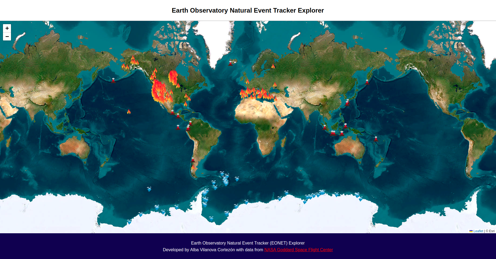

<h1 align="center"><b>EONET API Explorer</b></h1>

The app consists of a map showing the natural events that occurred between 2017 and 2024 worldwide. The data has been fetched from Earth Observatory Natural Event Tracker (EONET).



You can run it using:

```
bun render
```