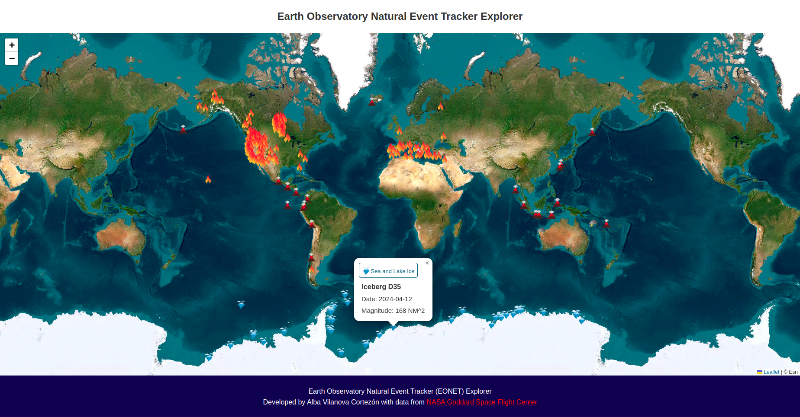
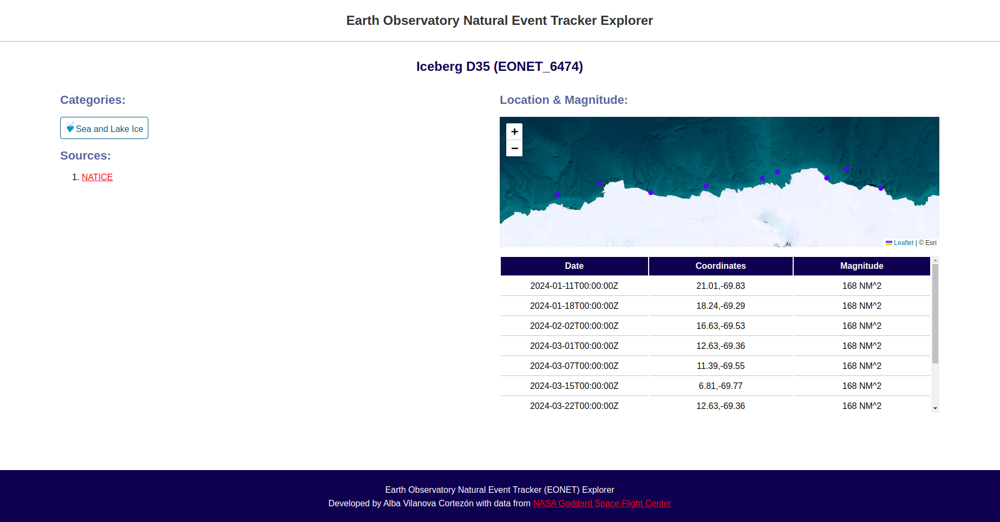

<h1 align="center"><b>EONET API Explorer</b></h1>

The app shows the natural events that occurred between 2000 and 2024 worldwide in a map. The data has been fetched from Earth Observatory Natural Event Tracker (EONET).



Each event can be accessed by clicking on the corresponding pop-ups and get detailed information.



You can run it using:

```
bun render
```